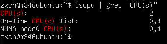
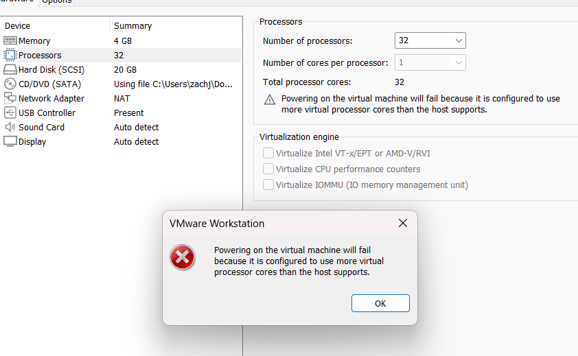
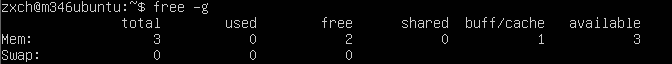
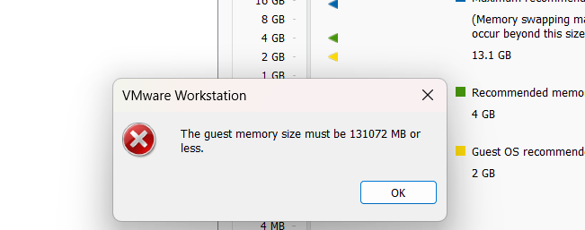

# C)

- Screenshot mit weniger CPU als mein Host-System
  

- Screenshot mit mehr CPU als mein Host-System
  

- Screenshot mit weniger RAM als mein Host-System
  

- Screenshot mit mehr CPU als mein Host-System
  

## Erklärung wieso ich Fehlermeldungen erhalte
Wenn ich in meiner virtuellen Maschine (VM) mehr Prozessorkerne oder RAM zuweise, als der Host-System hat, führt es zu Fehlermeldungen, da die VM-Software diese Überschreitung der Host-Kapazitäten erkennt und verhindert, um Systeminstabilität und Leistungsprobleme zu vermeiden. Solche Konfigurationen sind nicht machbar, weil es die physischen Grenzen der Hardware überschreiten würden.
