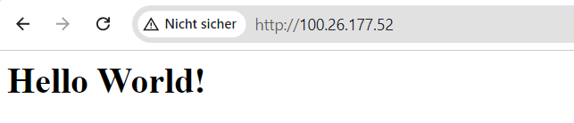
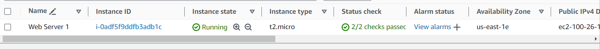
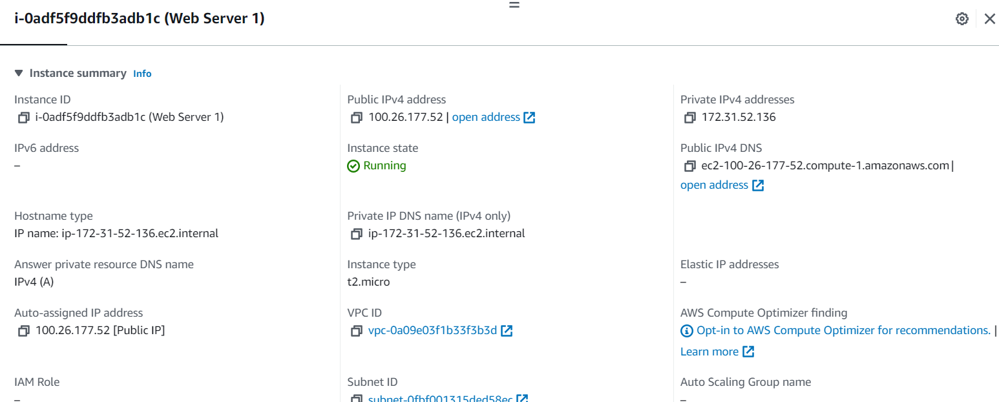
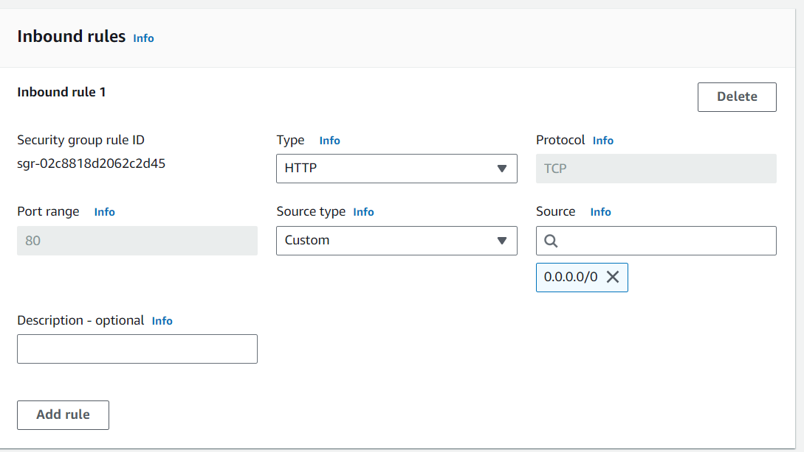
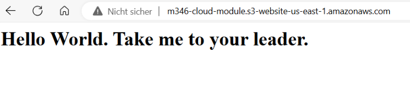
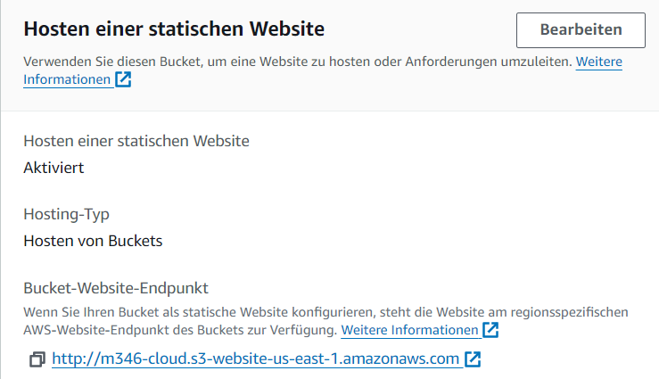

# Lab 4.1 - EC2)

- Screenshot von der HTML Seite
  

- Screenshot Liste der EC2 Instanzen
  

- Screenshot Details der Web Server-Instanz
  

- Screenshot Security Group Inbound Rules
  

# Lab 4.2 - S3)

- Screenshot von der Liste der Buckets![alt text]
  

- Screenshot von der HTML Seite
  

- Screenshot von der Liste der Dateien im Bucket
  

- Screenshot von der Eigenschaften von "Static website hosting"
  

## 
