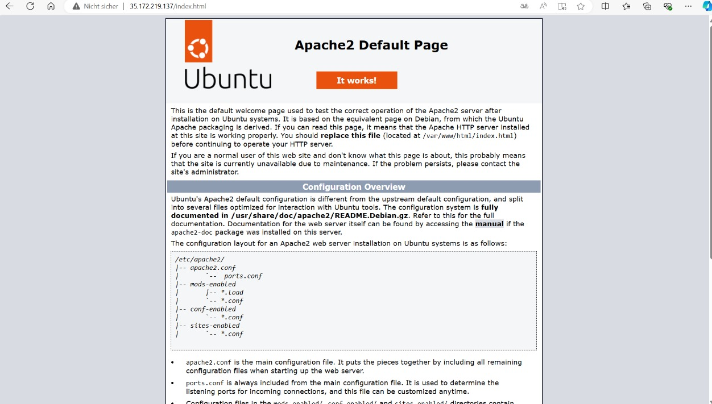
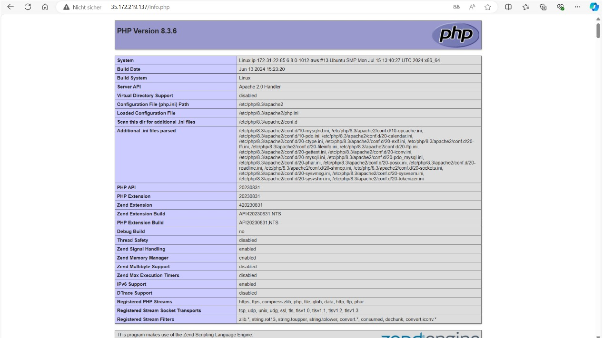
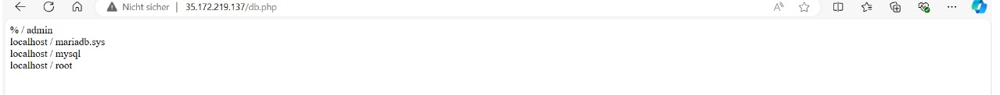
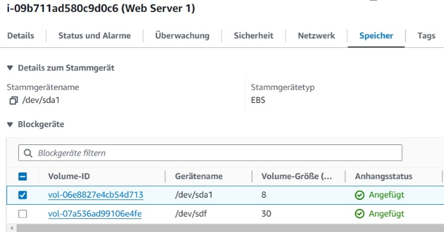

# A) Installation von Web- und Datenbankserver

- Screenshot von der Apache Seite
  

- Screenshot von der PHP Seite
  

- Screenshot von der Datenbankbenutzer
  

# B) Elastic Block Storage (EBS) hinzufügen
- Screenshot der EBS Volumen
  

### Erklärung dazu für was eine zusätzliche virtuelle Disk verwendet werden könnte

Zusätzlicher Speicherplatz: Eine weitere Speichereinheit bietet die Möglichkeit, grössere Datenmengen abzulegen, etwa für Datenbanken oder Dateiserver.

Backups: Eine separate Festplatte ermöglicht die Erstellung und Verwaltung von Backups unabhängig von der Hauptfestplatte. Dadurch wird das Risiko von Datenverlust bei Systemausfällen minimiert.

Datenbank-Segmentierung: Bei grossen Datenbankanwendungen können zusätzliche virtuelle Festplatten verwendet werden, um Datenbanktabellen oder -partitionen auf verschiedene physische Speichergeräte zu verteilen. Dies verbessert die Performance.

Protokolldateien und Zwischenspeicherung: Eine zusätzliche virtuelle Festplatte kann zur Ablage von Protokolldateien oder Cache-Daten genutzt werden.