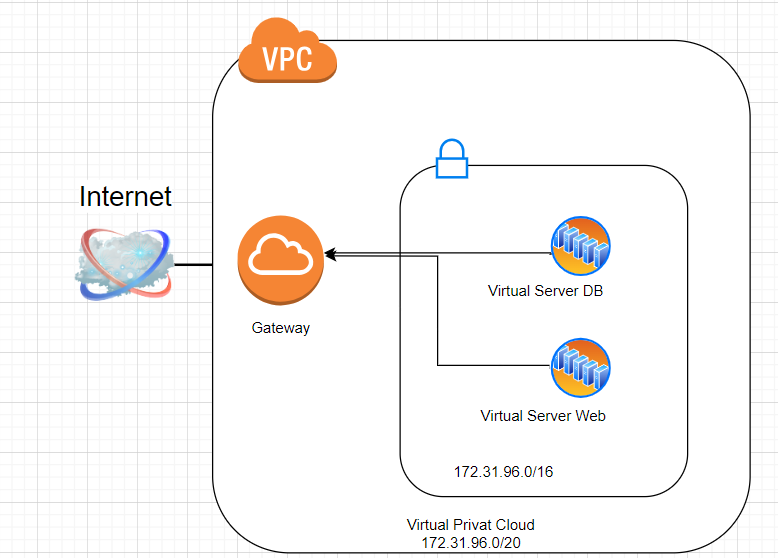
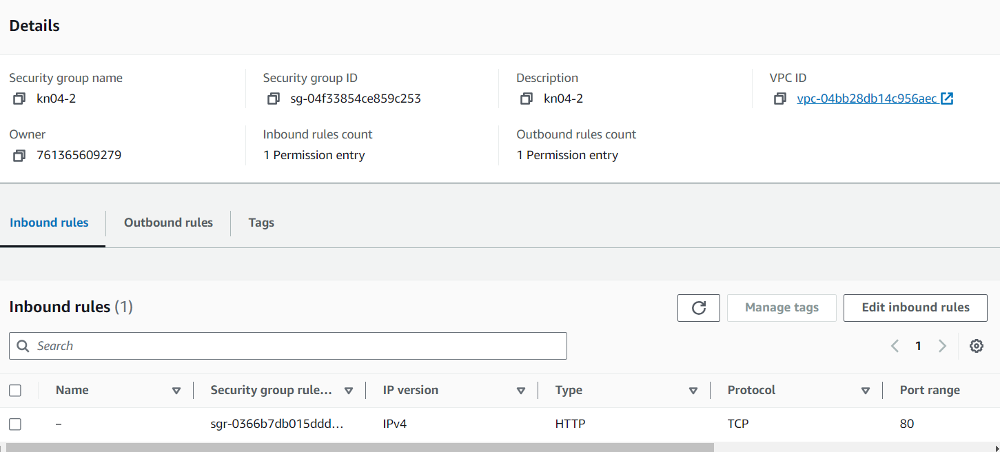
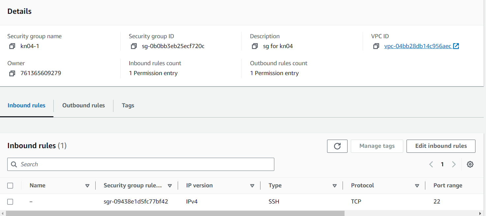
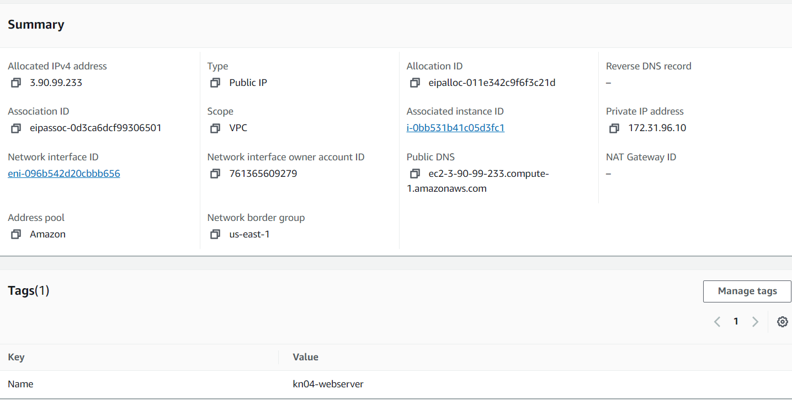
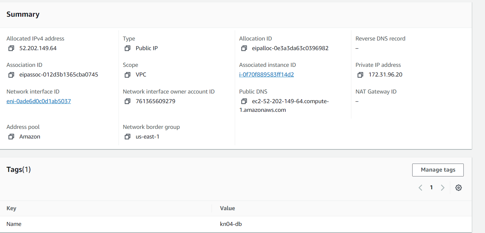
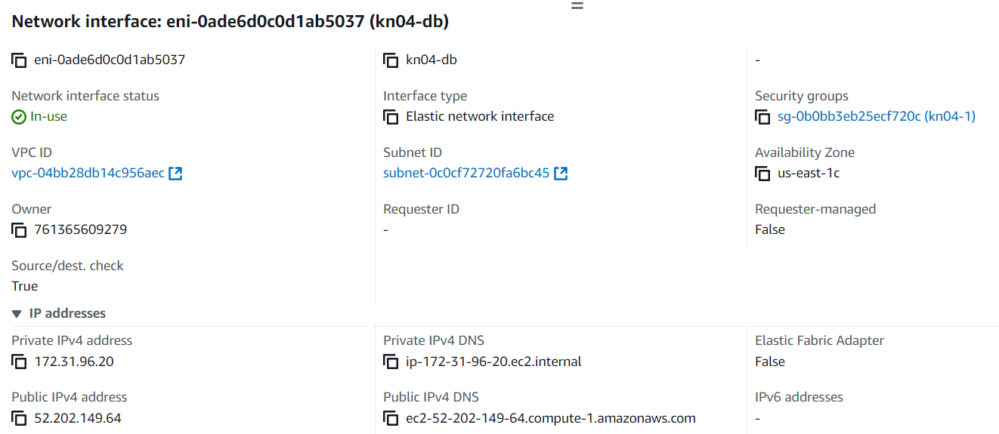
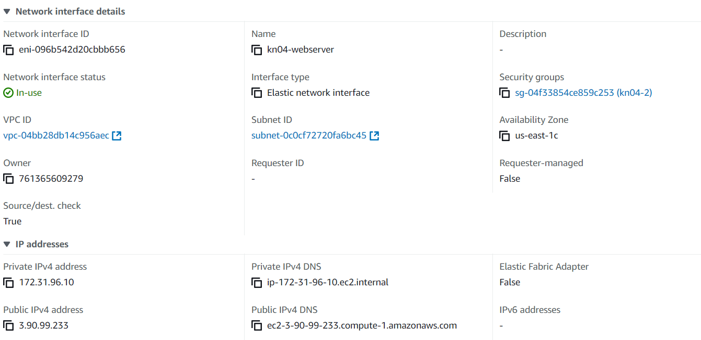
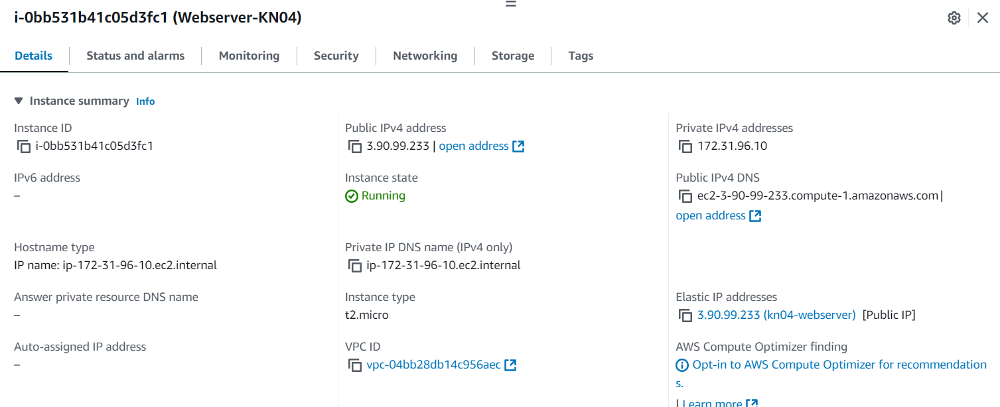
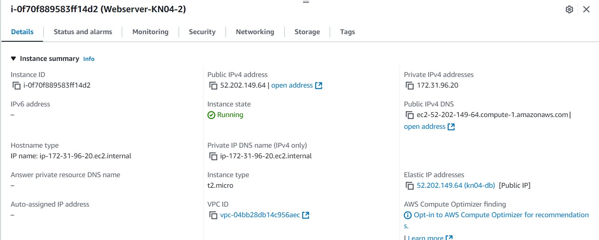

# A) Diagramm Erstellen

- Screenshot der Diagramm
  

- Was ist ein VPC?
Ein **VPC (Virtual Private Cloud)** ist ein privates Netzwerk in der Cloud, das dir erlaubt, 
deine eigenen Server und Daten sicher zu betreiben. Du kannst es wie ein eigenes, kontrolliertes 
Netzwerk im Internet sehen.

- Was ist ein Subnetz?
Ein **Subnetz** ist ein kleinerer Abschnitt innerhalb eines VPC, in dem du deine Server in verschiedene Gruppen 
aufteilen kannst. Es hilft, den Datenverkehr besser zu organisieren und die Sicherheit zu erhöhen.

# B) Subnetz und private IP wählen
- Screenshot der Subnetz
  

- Zwei IPs
 172.31.96.10
 172.31.96.20 

 # C) Objekte und Instanzen erstellen
- Sicherheitsgruppen
  
  

- Elastic IPs
  
  

- Netzwerk interfaces
  
  

- Instanzen erstellen
  
  