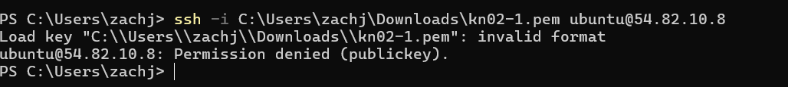

# B) SSH-Key und Cloud-init
- Details Instance
  
- Ersten Schlüssel
  
- Zweiten Schlüssel
  
- Log Befehl
  

# C) Template
- Details Instance
  

# D) Installation automatisieren
- Webseiten
  
  
  

