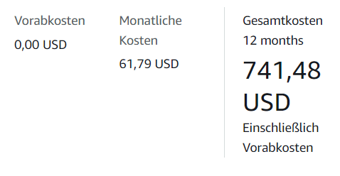
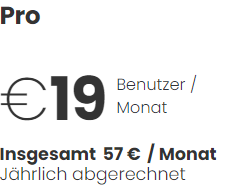

# 1) Rehosting

- Kosten für AWS

- Kosten für Azure
  

- Erklärung zu der Auswahl

  

# 2) Replatforming
 
- Kosten Heroku

- Erklärung zu der Auswahl

  asdasdasd

# 3) Repurchasing

- Kosten Zoho CRM

# B) Interpretation der Resultate

1. **Unterschiede der Angebote:**
   Die Angebote variieren erheblich in Bezug auf Kosten und Leistungsumfang. Azure bietet eine umfassende, aber teurere IaaS-Lösung, AWS mit Heroku eine mittelteure PaaS-Option, und Zoho CRM als SaaS ist die kostengünstigste und wartungsärmste Lösung.

2. **Das billigste Angebot:**
   Zoho CRM ist das kostengünstigste Angebot, vor allem, wenn die Kosten pro Benutzer betrachtet werden. Es bietet eine SaaS-Lösung, die minimale technische Verwaltung erfordert und schnell einsatzbereit ist.

3. **Preisunterschiede und deren Rechtfertigung:**
   Azure ist signifikant teurer als die anderen Optionen, bietet jedoch auch die umfangreichste Kontrolle und Anpassbarkeit, was es für Unternehmen mit spezifischen, technisch anspruchsvollen Anforderungen wertvoll macht. Dies rechtfertigt den höheren Preis für Organisationen, die eine komplexe Infrastruktur und hohe Leistungsanforderungen haben.